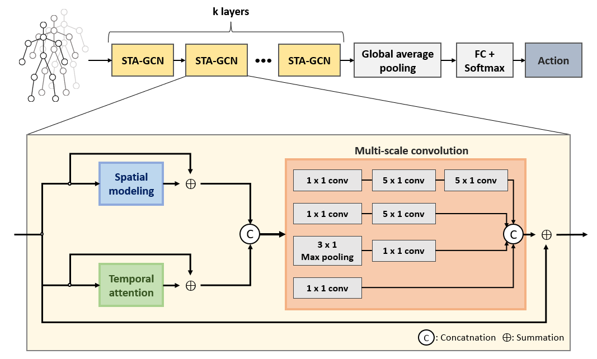

# STA-GCN
This repository is the implementation for "Spatio-temporal Attention Graph Convolutions for Skeleton-based Action Recognition".

## Architecture of CTR-GC


# Prerequisites
- Python 3.6.8
- `pip install -r requirements.txt `
- `pip install -e torchlight`

# Datasets
Download skeleton-based dataset: https://github.com/shahroudy/NTURGB-D
   1. `nturgbd_skeletons_s001_to_s017.zip` (NTU RGB+D 60)
   2. `nturgbd_skeletons_s018_to_s032.zip` (NTU RGB+D 120)

# Data Processing
Put downloaded data into the following directory structure:
```
- data/
   - ntur_raw/
      - nturgb+d_skeletons/     # from `nturgbd_skeletons_s001_to_s017.zip`
      ...
      - nturgb+d_skeletons120/  # from `nturgbd_skeletons_s018_to_s032.zip`
      ...
   - ntu60/
   - ntu120/
```

# Generating Data
```
 cd ./data/ntu60 or cd ./data/ntu120
 # Get skeleton of each performer
 python get_raw_skes_data.py
 # Remove the bad skeleton 
 python get_raw_denoised_data.py
 # Transform the skeleton to the center of the first frame
 python seq_transformation.py
```

# Training & Testing
- Change the config file depending on what you want.
```
# Example: training STA-GCN on NTU RGB+D 60 cross subject with GPU 0
python main.py --config config/nturgbd-cross-subject/default.yaml --work-dir work_dir/ntu60/csub/stagcn-joint --device 0
```

- To train model on NTU RGB+D 60/120 with bone or motion modalities, setting `bone` or `vel` arguments in the config file `default.yaml` or in the command line.
```
# Example: training CTRGCN on NTU RGB+D 60 cross subject under bone modality
python main.py --config config/nturgbd60-cross-subject/default.yaml --train_feeder_args bone=True vel=False --test_feeder_args bone=True vel=False --work-dir work_dir/ntu60/csub/stagcn-bone --device 0
```

- To test the trained models saved in <work_dir>, run the following command:
```
python main.py --config config/nturgbd60-cross-subject/config.yaml --work-dir <work_dir> --phase test --save-score True --weights <work_dir>/xxx.pt --device 0
```

- To ensemble the results of different modalities, run 
```
# Example: ensemble four modalities of CTRGCN on NTU RGB+D 60 cross subject
python ensemble.py --datasets ntu60/xsub --joint-dir work_dir/ntu60/xsub/stagcn-joint --bone-dir work_dir/ntu60/xsub/stagcn-bone --joint-motion-dir work_dir/ntu120/xsub/stagcn-joint-motion --bone-motion-dir work_dir/ntu120/xsub/stagcn-bone-motion
```

# Acknowledgements

This repo is based on [CTR-GCN](https://github.com/Uason-Chen/CTR-GCN).

Many thanks to the original authors for their work!

# Citation
```
@article{stagcn-scia2023,
    author = {Le, Cuong and Liu, Xin},
    title = {Spatio-temporal Attention Graph Convolutions for Skeleton-based Action Recognition},
    conference = {Scandinavia Conference on Image Analysis (SCIA)},
    year = {2023}
    }
```


